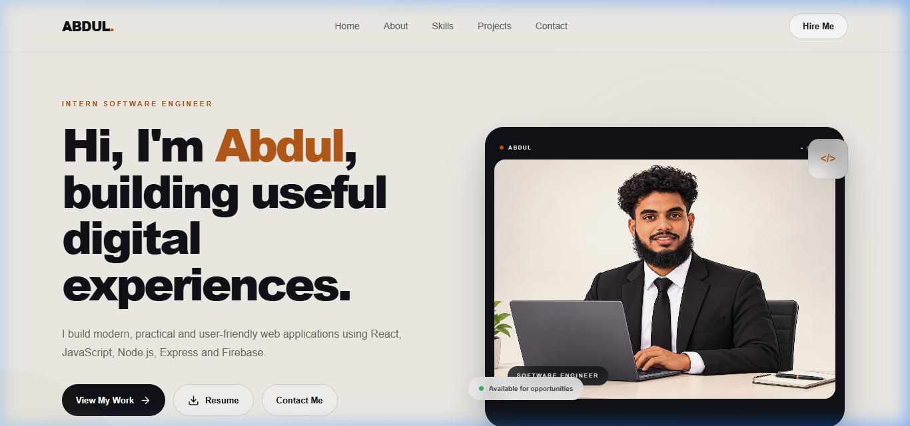

# Abdul Ahadh — Developer Portfolio

A responsive portfolio website for presenting my software engineering skills, selected projects, CV, and professional contact links.

**Live portfolio:** [abbhu-portfolio-f4ew.vercel.app](https://abbhu-portfolio-f4ew.vercel.app)  
**GitHub:** [abdulahadh3148](https://github.com/abdulahadh3148) · **LinkedIn:** [M. F. Abdul Ahadh](https://www.linkedin.com/in/m-f-abdul-ahadh-1aa231396)



## Highlights

- Responsive React portfolio with About, Skills, Process, Projects, Journey, and Contact sections.
- Scroll and interaction animations with Framer Motion.
- Featured work with project summaries, technology labels, and repository links.
- Downloadable CV.

## Tech stack

- React 19 and Vite
- Framer Motion
- Custom CSS
- Lucide React and React Icons

## Run locally

Requirements: Node.js and npm.

```bash
git clone https://github.com/abdulahadh3148/MY-Potfolio-2.0.git
cd MY-Potfolio-2.0
npm install
npm run dev
```

Open the local URL printed by Vite. To check a production build:

```bash
npm run build
npm run preview
```

## Featured projects

- [Eranga Driving School Management Platform](https://github.com/abdulahadh3148/Eranga-Driving-School-Management-Platform) — React, Firebase Authentication, Cloud Firestore, and Cloud Functions.
- [5Rose Coolspot Feedback](https://github.com/abdulahadh3148/5rose-feedback-saas) — Laravel customer feedback project.
- [Sparkle Salon](https://github.com/abdulahadh3148/Sparkle-Salon) — salon booking and management web application.
- [Jamiul Azhar Mosque](https://github.com/abdulahadh3148/Jamiul-Azhar-Mosque) — community web platform.

## Contact

Use the LinkedIn link above or the contact section on the live portfolio.

---
Built by Abdul Ahadh.
